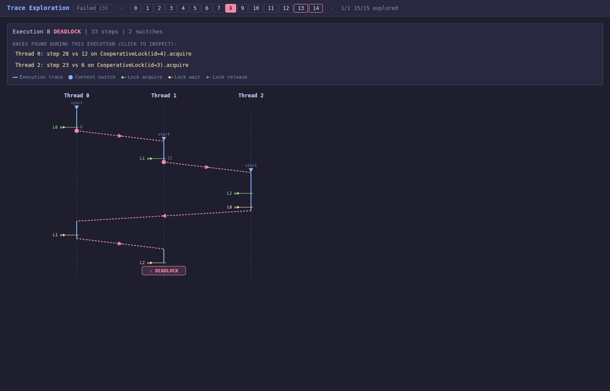

Frontrun Documentation
======================

**Deterministic concurrency testing for Python.**

Race conditions are hard to test because they depend on timing. A test that
passes 95% of the time is worse than one that always fails, because it breeds
false confidence. Frontrun replaces timing-dependent thread interleaving with
deterministic scheduling, so race conditions either always happen or never
happen.

         each acquire one fork (lock) then block waiting for the next,
         forming a cycle.

*DPOR finds the circular wait in the classic 3-philosopher dining problem ---
each thread's lock acquisitions (green), context switches (pink arrows), and
the point where the deadlock is detected.*

The four approaches
-------------------

Frontrun offers four ways to control thread interleaving, in order of
decreasing interpretability:

:doc:`DPOR (systematic exploration) <dpor_guide>`
   Systematically explores every meaningfully different interleaving. When a
   race is found, you get a causal explanation showing which shared-memory
   accesses conflicted. The most informative error traces; start here for
   automatic race finding.

:doc:`Bytecode exploration <approaches>`
   Random opcode-level schedules checked against an invariant. Often finds
   races on the first attempt and can catch races invisible to DPOR (such as
   C-extension shared state), at the cost of less interpretable traces.

:doc:`Marker schedule exploration <approaches>`
   Exhaustive exploration at the ``# frontrun:`` marker level. Much smaller
   search space than bytecode exploration, with completeness guarantees.

:doc:`Trace markers <quickstart>`
   Comment-based synchronization points for reproducing a known race window
   deterministically in a test. The simplest entry point once you already
   understand the race.

All four have async variants. A C-level ``LD_PRELOAD`` library intercepts
libc I/O for database drivers and other opaque extensions.

Where to go next
----------------

- **Test your own code, from scratch:** :doc:`installation` →
  :doc:`quickstart` → :doc:`dpor_guide`.
- **Test code that talks to Redis or SQL:** :doc:`redis`,
  :doc:`sql-technical-details`, or the lost-update walkthrough at
  :doc:`orm_race`.
- **Widen tracing into an installed package** (Django apps, plugins):
  :doc:`trace_filtering`.
- **Understand how DPOR works:** :doc:`dpor` (algorithm),
  :doc:`vector-clocks` (happens-before foundations), :doc:`search` (search
  strategies).
- **Look something up:** :doc:`api_reference`, :doc:`internals`.

.. toctree::
   :caption: Getting started
   :maxdepth: 2
   :hidden:

   installation
   quickstart
   approaches

.. toctree::
   :caption: Guides
   :maxdepth: 2
   :hidden:

   dpor_guide
   trace_filtering
   examples

.. toctree::
   :caption: Integrations
   :maxdepth: 2
   :hidden:

   redis
   sql-technical-details
   orm_race

.. toctree::
   :caption: Algorithm internals
   :maxdepth: 2
   :hidden:

   dpor
   vector-clocks
   search

.. toctree::
   :caption: Reference
   :maxdepth: 2
   :hidden:

   api_reference
   internals
   Case studies <CASE_STUDIES>
